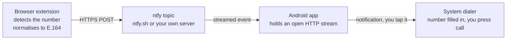

# DialBridge

Click a phone number in your computer's browser; your Android phone opens its
dialer with that number ready to call.

No Google account, no Firebase, no cloud service of mine in the middle. The
browser publishes to an [ntfy](https://ntfy.sh) topic and the phone is
subscribed to it — that is the whole mechanism, and you can host it yourself.

---

## How it works



Three deliberate choices shape the design:

**No push service.** Most Android apps receive messages through Firebase Cloud
Messaging, which requires Google Play Services on the device and Google's
servers in the path — meaning the number you are about to call passes through
them. DialBridge instead keeps its own connection open to a small, open-source
message broker. It works on de-Googled phones, and it can be distributed
through F-Droid.

**The app never places a call.** It fills in the number and stops. That is why
it requests no `CALL_PHONE` permission: the decision to dial always stays with
the person holding the phone.

**No build step for the extension.** Plain JavaScript, no bundler, no
dependencies. What you review is what runs.

---

## Setup

### 1. The phone

Build the app, or install a release APK:

```bash
cd android
./gradlew assembleDebug
adb install app/build/outputs/apk/debug/app-debug.apk
```

Open it, tap **Generate** to create a topic, then **Start listening**.

If your phone is aggressive about background apps — most are — also tap
**Allow running in the background**.

### 2. The browser

Chrome, Edge, or any Chromium browser:

1. Go to `chrome://extensions`
2. Turn on **Developer mode**
3. **Load unpacked** → select the `extension/` folder

Open the extension's popup and enter:

- **Topic** — the same value the phone app shows
- **Country code** — digits only, e.g. `30`. Needed for numbers written without
  a leading `+`

Press **Send a test**. Your phone should show a notification for a fake number.

---

## Using it

- **Click any `tel:` link.** No desktop "choose an application" dialog.
- **Click an underlined number.** Numbers written as plain text are marked with
  a dotted underline and become clickable.
- **Select a number and right-click** → *Send number to my phone*, for numbers
  the page renders in some way the detector cannot see.

On the phone, tap the notification and the dialer opens with the number in it.

---

## Security

The topic name is the only thing preventing a stranger from making your phone
ring. It is generated from a cryptographic random source and is long enough
that guessing it is not practical, but it is **not** a secret in the strong
sense: it travels in the URL, and on the public `ntfy.sh` server the operator
can see it.

For anything beyond convenience, run your own ntfy server and turn on access
control. Both the app and the extension accept an access token, and the server
field accepts any address:

```bash
docker run -p 80:80 -v /var/lib/ntfy:/var/lib/ntfy binwiederhier/ntfy serve
```

The phone also refuses anything that does not look like a phone number, so a
stranger who did learn your topic could annoy you but could not use the
notification to send arbitrary content.

---

## Trade-offs, stated plainly

**Battery.** Holding your own connection costs more than sharing the one
Google's push service already maintains. In practice ntfy sends a keepalive
about every 45 seconds, which is modest, but it is not free.

**Number detection is a heuristic.** A full parser such as libphonenumber is
around 200 KB and would dominate a small extension. The recogniser here handles
the common written forms, requires at least nine digits, and prefers to miss an
unusual number rather than offer a wrong one. Order numbers and years are
rejected on purpose — see `extension/test/phone.test.js` for the exact cases.

**It is not a phone system.** No VoIP, no recording, no call log. It moves a
number from one screen to another.

---

## Development

```bash
node extension/test/phone.test.js   # recogniser tests, no framework needed
cd android && ./gradlew assembleDebug
```

The Android app has no third-party runtime dependencies beyond AndroidX: the
subscriber uses the JDK's own HTTP client, which keeps the build free of
proprietary components.

Layout:

```
extension/     Chromium MV3 extension — detection, normalisation, publishing
  src/phone.js       number recognition, shared by the page script and popup
  src/content.js     click interception and plain-text markup
  src/background.js  the only code that touches the network
android/       Kotlin app — subscription, notification, dialer hand-off
  SubscriberService.kt   the open connection and its reconnect logic
  Notifications.kt       the two channels and the dial intent
```

---

## Licence

MIT — see [LICENSE](LICENSE).
