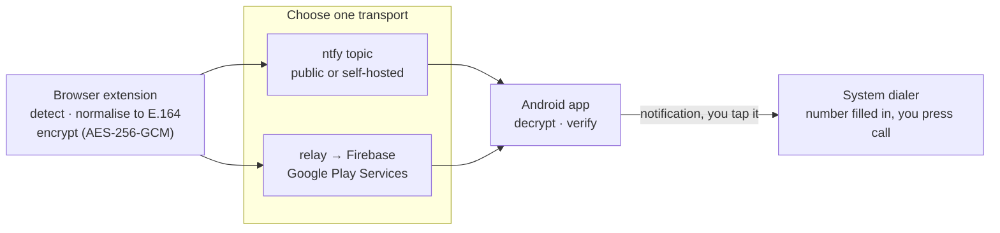

# DialBridge

Click a phone number in your computer's browser; your Android phone opens its
dialer with that number ready to call.

The number is **encrypted in the browser and decrypted on the phone**. Whatever
carries it in between — a public message server, Google's push
infrastructure — handles ciphertext it cannot read.

---

## How it works



**Two transports, one app.** Pick per install:

| | Own connection (ntfy) | Google Play Services (Firebase) |
|---|---|---|
| Battery | Holds a socket open | Borrows the system's existing connection |
| Needs Play Services | No — works on de-Googled phones | Yes |
| Needs a server of yours | No | Yes, a small relay |
| Can ship on F-Droid | Yes | No |
| Can ship on Google Play | Yes, but a permanent socket draws scrutiny | Yes, the expected design |

**The encryption is what makes that choice free of consequence.** Under either
route the carrier sees a blob. The key is generated on the phone, travels once
inside the pairing code you copy across yourself, and is never transmitted
again.

**The app never places a call.** It fills in the number and stops, which is why
it requests no `CALL_PHONE` permission — the decision to dial stays with the
person holding the phone.

**No build step for the extension.** Plain JavaScript, no bundler, no
dependencies. What you review is what runs.

---

## Setup

### 1. The phone

```bash
cd android
./gradlew assembleDebug
adb install app/build/outputs/apk/debug/app-debug.apk
```

Open the app and choose a delivery route.

- **Own connection** — press *Generate pairing code*, then *Start listening*.
- **Google Play Services** — deploy [the relay](relay/README.md), put its
  address in the app, then press *Generate pairing code*. This route needs a
  Firebase project: drop your own `google-services.json` into `android/app/`
  and rebuild. Without that file the app still builds and runs, with the
  Firebase option inactive — that is the F-Droid build.

Most phones are aggressive about background apps, so also tap *Allow running in
the background*.

### 2. The browser

Chrome, Edge, or any Chromium browser:

1. Go to `chrome://extensions`
2. Turn on **Developer mode**
3. **Load unpacked** → select the `extension/` folder

Open the popup, paste the pairing code from the phone, set your **country
code** (digits only, e.g. `30` — needed for numbers written without a leading
`+`), and press **Save**, then **Send a test**. The phone should show a
notification for an obviously fake number.

The pairing code carries your encryption key. Treat it like a password, and
generate a new one to revoke a computer's access.

---

## Using it

- **Click any `tel:` link** — no desktop "choose an application" dialog.
- **Click an underlined number** — plain-text numbers are marked and clickable.
- **Select a number and right-click** → *Send number to my phone*, for numbers
  the detector cannot see.

---

## Privacy

Read [PRIVACY.md](PRIVACY.md). In short: nothing is collected, nothing is
stored beyond the pairing itself, there is no analytics and no account, and
both sides have a real delete control rather than a paragraph promising one.

If you are an individual using this for yourself, GDPR's household exemption
means none of its obligations attach to you. If you deploy it for an
organisation, PRIVACY.md sets out what does.

---

## Trade-offs, stated plainly

**Battery versus independence.** Holding your own connection costs more power
than borrowing the one Play Services already maintains. ntfy's keepalive is
about every 45 seconds, which is modest but not free. The Firebase route is
cheaper and brings Google into the path — carrying ciphertext, but present.

**Number detection is a heuristic.** A full parser such as libphonenumber is
around 200 KB and would dominate a small extension. This recogniser handles the
common written forms, requires at least nine digits, and prefers to miss an
unusual number rather than offer a wrong one. Years and order numbers are
rejected on purpose — see `extension/test/phone.test.js` for the exact cases.

**Delivery addresses are not secrets.** Someone who learned your topic or
device token could make your phone buzz. They could not make it show a number
of their choosing: forged messages fail authentication and are dropped.

**It is not a phone system.** No VoIP, no recording, no call log. It moves a
number from one screen to another.

---

## Development

```bash
node extension/test/phone.test.js   # recogniser tests, no framework needed
cd android && ./gradlew assembleDebug
```

```
extension/
  src/phone.js       number recognition, shared by page script and popup
  src/crypto.js      AES-GCM encryption and the pairing format
  src/content.js     click interception and plain-text markup
  src/background.js  the only code that touches the network
android/
  Crypto.kt              decryption; also the authentication check
  SubscriberService.kt   the ntfy connection and its reconnect logic
  PushService.kt         the Firebase receiver
  Notifications.kt       the two channels and the dial intent
relay/                   optional; only for the Firebase transport
```

---

## iPhone

There is an iOS companion at
[gruncode/dialbridge-ios](https://github.com/gruncode/dialbridge-ios). **The
extension in this repository drives it too** — the pairing code format is
shared, so switching phones changes nothing on the desktop.

iOS cannot offer the own-connection transport: Apple permits no background
sockets and no push outside its own service. The encryption carries over
unchanged, so Apple routes ciphertext it cannot read.

---

## Licence

MIT — see [LICENSE](LICENSE).
